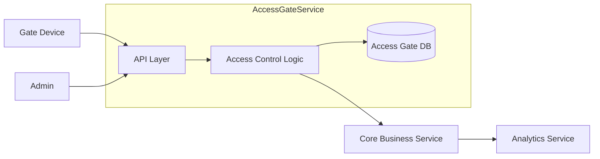

# Service Boundary của nhóm

## 1. Thông tin nhóm

- Tên nhóm: Nhóm 10
- Lớp: CNTT 17-13
- Thành viên:Phạm Khắc Hoàng
- Service nhóm phụ trách: Access Gates
- Sản phẩm tổng thể của lớp: ...

## 2. Actor

Ai tương tác với hệ thống/service?
Gate Device (Thiết bị cổng RFID)
Admin (Quản trị hệ thống)
Student / Staff (Người dùng hệ thống)
## 3. System Boundary

Nhóm em xây phần nào?
Xây dựng dịch vụ kiểm soát ra/vào.
Phần nhóm kiểm soát:

    -Xử lý request quẹt thẻ
    -Kiểm tra quyền truy cập
    -Quản lý dữ liệu:
    -Card
    -Person
    -Gate
    -Access Log
    -Ghi log truy cập
    -Trả kết quả cho Gate

Phần nhóm chỉ tích hợp:

    -Person Service 
    -Notification Service
    -Central Authentication Service
    -Reporting Service

## 4. Service Boundary

Service của nhóm có trách nhiệm gì?

    quản lý thông tin thẻ, người dùng, cổng ra/vào và access log

Service KHÔNG làm gì?

    Không quản lý tài khoản đăng nhập hệ thống
    Không xử lý thanh toán
    Không quản lý học vụ
    Không gửi thông báo (chỉ trả kết quả)
    Không phân tích thống kê

## 5. Input / Output

### Input

- {
"card_id": "RFID-2026-001",
"gate_id": "gate-main",
"direction": "IN",
"timestamp": "2026-05-02T07:30:00"
}

### Output

- {
"access_granted": true,
"reason": "Valid student card",
"person_id": "SV001"
}

## 6. API dự kiến

| Method | Endpoint      | Mục đích                |
| ------ | ------------- | ----------------------- |
| GET    | /health       | Kiểm tra service        |
| POST   | /access/check | Kiểm tra quyền truy cập |
| GET    | /cards/{id}   | Lấy thông tin thẻ       |
| POST   | /cards        | Tạo thẻ mới             |
| GET    | /gates        | Danh sách cổng          |
| GET    | /logs         | Lấy access log          |

## 7. Phụ thuộc service khác

Service này gọi đến service nào?

    Identity Service 
    Student Service
    Staff Service

Service nào gọi đến service này?

    Gate Device
    Monitoring Service
    Reporting Service

## 8. Sơ đồ minh họa

